<p align="center">
  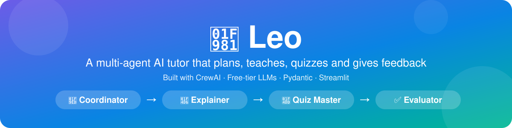
</p>

<h3 align="center">A study assistant made of four collaborating AI agents that plan, teach, quiz and give feedback.</h3>

<p align="center">
  <a href="https://www.python.org/"></a>
  <a href="https://www.crewai.com/"></a>
  <a href="https://streamlit.io/"></a>
  <a href="https://docs.pydantic.dev/"></a>
  
  
</p>
<p align="center">
  
  
  
  <a href="LICENSE"></a>
  
  
</p>

<p align="center">
  <a href="#quick-start"><b>Quick start</b></a> ·
  <a href="#architecture"><b>Architecture</b></a> ·
  <a href="#meet-the-agents"><b>Agents</b></a> ·
  <a href="#token-optimization"><b>Token savings</b></a> ·
  <a href="#troubleshooting"><b>Troubleshooting</b></a> ·
  <a href="https://drive.google.com/file/d/18-VSJO2wC6HE59OAKHZIfVM8XL5ZE_hr/view?usp=sharing"><b>Demo video</b></a>
</p>

---

## Table of contents

1. [Overview](#overview)
2. [Key features](#key-features)
3. [Quick start](#quick-start)
4. [Meet the agents](#meet-the-agents)
5. [Architecture](#architecture)
6. [Orchestration pattern](#orchestration-pattern)
7. [Memory](#memory)
8. [Prompt templates](#prompt-templates)
9. [Tools](#tools)
10. [Error handling and fallback chain](#error-handling-and-fallback-chain)
11. [Token optimization](#token-optimization)
12. [Project structure](#project-structure)
13. [Installation](#installation)
14. [Free API keys](#free-api-keys)
15. [Configuration](#configuration)
16. [How to run](#how-to-run)
17. [Example session](#example-session)
18. [Logging and debugging](#logging-and-debugging)
19. [Testing](#testing)
20. [Troubleshooting](#troubleshooting)
21. [Security](#security)
22. [Limitations](#limitations)
23. [Roadmap](#roadmap)
24. [Assignment requirements coverage](#assignment-requirements-coverage)
25. [Contributing](#contributing)
26. [License](#license)
27. [Acknowledgements](#acknowledgements)

---

## Overview

**Leo** is a multi-agent AI tutor. A student names a topic, and a small team of specialised agents works together, with real hand-offs between them, instead of one chatbot doing everything:

1. The **Coordinator** reads the request and decides who acts next. It also handles unclear or unsafe messages.
2. The **Explainer** teaches the topic in 250 words or fewer.
3. The **Quiz Master** writes multiple-choice questions as validated JSON.
4. The **Evaluator** gives specific, encouraging feedback on the student's answers.

If the score is low, Leo **loops back** to re-teach only the weak concepts and runs a mini quiz. At any moment the student can **intervene** ("explain simpler", "skip to the quiz", "harder quiz", "change topic") and the Coordinator re-routes.

Leo runs entirely on **free-tier LLMs** (Groq primary, Google Gemini fallback, optional local Ollama) and is designed around **minimum token use**. A complete lesson, quiz and grading cycle used roughly **1,800 to 2,000 tokens in 3 LLM calls** in our live runs.

> Built as the Module 26 assignment, "Leo: Multi-Agent AI Tutor".

## Key features

| Area | What Leo does |
|---|---|
| **Four distinct agents** | Coordinator, Explainer, Quiz Master and Evaluator, each with its own role, goal, backstory, YAML prompt template and model tier |
| **Real hand-offs** | Structured payloads move between agents (Coordinator → Explainer → Quiz Master → Evaluator). Every hand-off is shown in the UI and written to `logs/handoffs.jsonl` |
| **CrewAI orchestration** | Every agent step is a real CrewAI `Agent` running a `Task` inside a sequential `Crew`, steered by a Coordinator routing step |
| **Structured output** | The Quiz Master, Evaluator and Coordinator return validated Pydantic models. Messy JSON is cleaned and broken JSON is repaired or retried |
| **Memory** | SQLite stores the student's name, topic, level, weak areas, last score and history, plus a lesson cache |
| **Bonus: feedback loop** | Scores below a threshold send weak concepts back to the Explainer for a targeted re-teach and a mini quiz (capped at N rounds) |
| **Bonus: human-in-the-loop** | The student can interrupt at any stage, in the CLI and in the web UI |
| **Graceful failure** | Retries with exponential backoff, JSON repair, a model fallback chain, safe defaults and friendly error messages. Leo never crashes on an LLM problem |
| **Optional tools** | A safe calculator (no `eval`) and a DuckDuckGo search tool, both switchable in `.env` |
| **Two interfaces** | A Streamlit web app with a live **Agent Activity** panel, and a colored CLI |
| **Observability** | Colored console logs, rotating log files, structured hand-off logs, API-key redaction, per-session JSON traces and a debug mode |
| **Token efficient** | Rule-based routing, code-based grading, compact payloads, lesson caching and per-role token ceilings |
| **Tested** | 153 pytest tests that run with no API keys and no tokens |

## Quick start

```bash
git clone https://github.com/ShaifulPalash/leo-ai-tutor.git
cd leo-ai-tutor
python3 -m venv .venv && source .venv/bin/activate      # Windows: .venv\Scripts\Activate.ps1
pip install -r requirements.txt
cp .env.example .env                                    # then paste your two free API keys into .env
python scripts/check_setup.py                           # verifies Python, keys and model names (0 tokens)
streamlit run app.py --server.fileWatcherType none      # open http://localhost:8501
```

No API keys yet? Try the scripted demo, which makes **no API calls**:

```bash
python -m leo.cli --offline --name Demo
```

## Meet the agents

| Agent | Role | Goal | Input | Output (validated) | Default model (tier) |
|---|---|---|---|---|---|
| **Coordinator** | Front desk and router | Understand the request and route it to the right specialist. Handle unclear or unsafe input | Student message, stage, current topic and level | `RoutingDecision` {intent, topic, level, reply} | `groq/openai/gpt-oss-20b` (fast), fallback `gemini/gemini-3.5-flash-lite`. Obvious requests are routed by 0-token rules |
| **Explainer** | Teacher | Teach one concept clearly in 250 words or fewer, with 3 to 5 key points and one example | Topic, level, style (normal or simple), focus, word limit | `Explanation` {explanation, key_points, example} | `groq/openai/gpt-oss-120b` (smart), fallback `gemini/gemini-3.8-flash`. Optional calculator and web search |
| **Quiz Master** | Exam writer | Write fair multiple-choice questions that test only what was taught | **Only** topic and key points (a compact hand-off), plus level, count, difficulty and focus concepts | `Quiz` {questions with 4 options, correct_index, concept} | smart tier (same as Explainer) |
| **Evaluator** | Supportive mentor | Turn graded results into specific, encouraging feedback | Score and a compact summary of the **wrong** answers only | `FeedbackNote`, combined with the code-computed grade into `EvaluationReport` | fast tier (same as Coordinator). Skipped when the score is perfect |

All agents are created with `allow_delegation=False`, a small `max_iter`, `max_rpm` and a hard time cap. **The orchestrator decides who acts next, not the LLM.** This is what keeps the pipeline predictable and cheap on small free models.

## Architecture

### How the agents interact

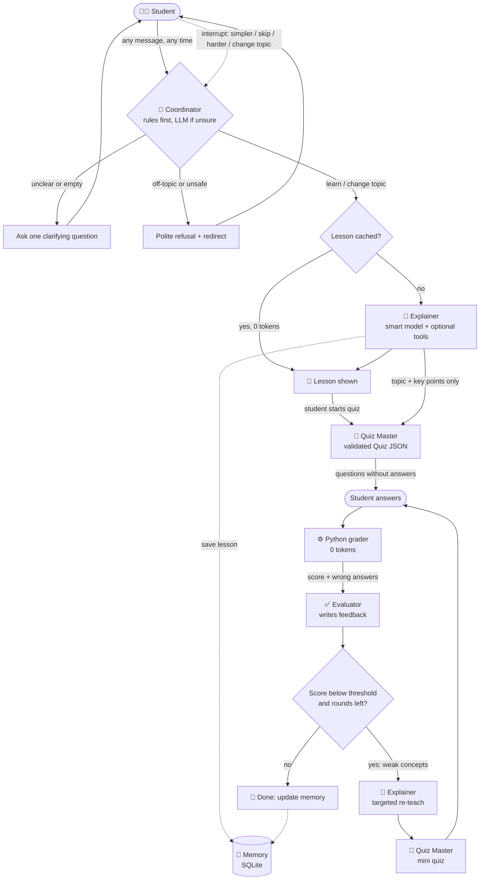

### Sequence of hand-offs (including the feedback loop and human-in-the-loop)

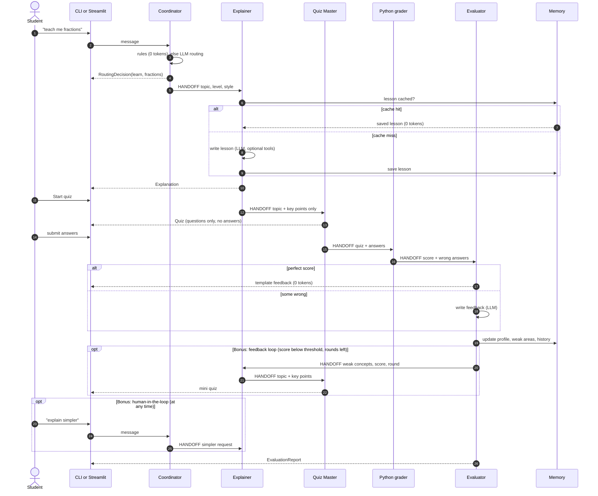

> **Exporting the diagrams as PNG (for slides or the demo video):** paste either diagram into <https://mermaid.live>, then choose *Actions → PNG*. Or use the CLI: `npx @mermaid-js/mermaid-cli -i diagram.mmd -o docs/architecture.png`.

## Orchestration pattern

**Leo is a sequential pipeline with a Coordinator routing step**, implemented as a small state machine (`idle → lesson → quiz → done`) in `leo/crew.py`. Each specialist step is a one-task **sequential CrewAI Crew**, rebuilt for every attempt so the fallback chain can swap the underlying model.

**Why not CrewAI's hierarchical (manager) process?**

| Criterion | Hierarchical (manager LLM) | Sequential + Coordinator routing (**chosen**) |
|---|---|---|
| Token cost | High: the manager re-reads context and reasons on every delegation | Low: one small routing call (or none), then fixed steps |
| Reliability on small free models | Weak: small models often mis-delegate or loop | Strong: order is decided by code |
| Predictability (demo, tests) | Varies from run to run | Same flow every time, fully testable with scripted agents |
| Autonomy | Higher | Lower. This is an acceptable trade-off for a tutoring flow |

The Coordinator is still a real agent. It classifies each message into one of `learn`, `change_topic`, `simpler`, `harder_quiz`, `skip_to_quiz`, `clarify` or `refuse`, and the orchestrator then runs the right specialists in order.

**Human-in-the-loop** works because `handle_message()` accepts input at *any* stage:

| The student says | Coordinator intent | What happens |
|---|---|---|
| "explain simpler" | `simpler` (0-token rule) | The Explainer re-teaches in a simple style |
| "skip to the quiz" | `skip_to_quiz` (rule) | The Quiz Master runs immediately |
| "give me a harder quiz" | `harder_quiz` (rule) | 5 harder questions |
| "change topic" / a new topic | `clarify` / `learn` | State resets and a new lesson starts |
| (empty or vague text) | `clarify` | One clarifying question, no crash |
| (off-topic or unsafe) | `refuse` | Polite refusal and a redirect |

**Feedback loop:** after grading, if `score < SCORE_THRESHOLD` and fewer than `MAX_RELEARN_ROUNDS` rounds have run, the Evaluator hands the weak concepts to the Explainer (targeted re-teach, 120 words or fewer), then the Quiz Master writes a 3-question mini quiz. The cap prevents infinite loops and token burn.

## Memory

Leo remembers **compact facts, never transcripts**, in a single SQLite file (`data/leo_memory.db`, git-ignored):

| Table | Stores | Used for |
|---|---|---|
| `students` | name, current topic, level, weak areas (max 8), last score, session count | Greeting returning students, starting level, focusing the next quiz on weak concepts |
| `history` | one row per finished quiz (newest 20 per student) | Progress over time (`/memory` in the CLI) |
| `explanation_cache` | finished lessons keyed by `(topic, level, style)` | Repeat topics cost **0 Explainer tokens** |

Details worth knowing:
- Weak areas are merged intelligently: new weaknesses go first and mastered concepts are removed.
- Targeted re-teach lessons are **not** cached, because they depend on the student's mistakes. "Simple" style lessons are cached separately from normal ones.
- A scored 90% or higher with no re-teach moves the student up a level for the next topic.
- A corrupt database file is moved aside (`*.corrupt-<timestamp>`) and a fresh one is created.
- Privacy: `/forget` (CLI) or **Forget me** (web) deletes everything stored about a student.
- **Why not CrewAI's built-in memory?** It relies on an embeddings model, which means extra API calls, extra quota and different behaviour per provider. Plain SQLite costs zero tokens, is easy to inspect and does everything this project needs.

## Prompt templates

Each agent has its own template in `leo/prompts/*.yaml`, loaded by `leo/prompts/loader.py`:

| File | Variables |
|---|---|
| `coordinator.yaml` | `stage`, `current_topic`, `level`, `message` |
| `explainer.yaml` | `topic`, `level`, `style_hint`, `focus`, `max_words` |
| `quiz_master.yaml` | `num_questions`, `topic`, `level`, `difficulty_hint`, `key_points`, `focus` |
| `evaluator.yaml` | `score_pct`, `correct`, `total`, `topic`, `level`, `wrong_summary` |

Each file defines `role`, `goal` and `backstory` (used to build the CrewAI agent) and a `task_template` with `{{variables}}`. The loader fails loudly if a variable is missing, and substitutes values in a single pass so user text such as `{{stage}}` is never expanded twice. The student's message is wrapped in a fenced data block with triple quotes neutralised, as basic prompt-injection hygiene. A test enforces that every rendered prompt stays under 300 tokens.

## Tools

Both tools are optional, switchable in `.env`, and given **only to the Explainer** (tool descriptions cost tokens on every call).

| Tool | Setting | Notes |
|---|---|---|
| `calculator` | `ENABLE_CALCULATOR=true` (default) | Parses the expression with Python's `ast` and evaluates only numbers, `+ - * / // % **`, a few math functions and `pi`/`e`. Exponents and result sizes are capped, so `9**9**9` and `__import__('os')` are refused |
| `web_search` | `ENABLE_WEB_SEARCH=false` (default) | DuckDuckGo via `ddgs`, no API key. At most 3 short snippets per search and 2 searches per lesson |

## Error handling and fallback chain

Every agent call goes through one guarded function, `LLMFactory.run_with_fallback()`.

```
for each model in the chain (primary -> fallback -> optional local Ollama):
    wait for the rate limiter (sliding window, MAX_RPM)
    try the call
       success                      -> record tokens and latency, return
       429 / quota, wait <= 30 s    -> exponential backoff (1s, 2s, 4s + jitter), retry
       429 / quota, wait > 30 s     -> switch to the next model instead of waiting
       timeout / 5xx / network      -> backoff and retry, then next model
       invalid JSON or schema       -> ONE retry with a repair prompt, then next model
       bad key / 400 / 404 / retired model -> skip this model immediately, no waiting
if every model failed -> use a safe default if one exists, else a friendly message
```

| Situation | What Leo does |
|---|---|
| Empty or unclear request | The Coordinator asks one clarifying question (0 tokens) |
| Off-topic or unsafe request | Polite refusal and a redirect to study topics |
| Coordinator LLM unreachable | A simple rule-based default decides, or asks the student to name a topic |
| Evaluator LLM unreachable | Template feedback built from the graded result |
| Every model fails (busy or rate-limited) | Friendly "team is busy, try again in a minute" message. Progress is kept |
| Every model fails (rejected keys or names) | A different message: "API keys or model names look wrong. Run `python scripts/check_setup.py`" |
| A UI callback raises an error | Logged and ignored. It can never break tutoring |
| Re-teach step fails | The score report is still shown, with a note to retry |

**Default fallback chains** (names live in `.env`, never hard-coded):

| Tier | Primary | Fallback | Optional last resort |
|---|---|---|---|
| fast (Coordinator, Evaluator) | `groq/openai/gpt-oss-20b` | `gemini/gemini-3.5-flash-lite` | Ollama (`OLLAMA_ENABLED=true`) |
| smart (Explainer, Quiz Master) | `groq/openai/gpt-oss-120b` | `gemini/gemini-3.8-flash` | Ollama |

> Free-tier model names change often. Run `python scripts/check_setup.py` to verify your names, and see [Troubleshooting](#troubleshooting).

## Token optimization

| Technique | Where | Effect |
|---|---|---|
| Small model for routing and feedback, larger model only where quality matters | `llm_factory.py`, `agents.py` | Cheaper, faster |
| **Grading is done in Python**, not by an LLM | `schemas.grade_quiz` | 0 tokens, exact, no AI grading mistakes |
| Perfect score skips the Evaluator LLM call | `crew.py` | 0 tokens for feedback |
| Rule-based Coordinator fast path (simpler, skip, harder, empty message) | `crew.quick_route` | 0 tokens for interventions |
| **Compact hand-offs**: the Quiz Master gets only topic and key points. The Evaluator gets only the wrong answers | `schemas.Explanation.to_quiz_brief`, `tasks.describe_wrong_answers` | No conversation history is ever replayed |
| Lesson cache keyed by (topic, level, style) | `memory.py` | Repeat topics cost 0 Explainer tokens |
| Memory holds a summary, not transcripts | `memory.py` | Small context |
| Strict word limits in every prompt (lesson ≤ 250 words, 3 to 5 key points, quiz of 3 to 5 questions) | `prompts/*.yaml` | Short outputs |
| Prompt budget test (every prompt under 300 tokens) | `tests/test_helpers.py` | Prompts cannot silently grow |
| `max_tokens`, `max_iter`, `max_rpm` per agent, no delegation loops | `agents.py`, `.env` | No runaway loops |
| Re-teach loop capped at N rounds | `crew.py` | Bounded cost |
| Live token and latency counter | UI usage table, logs, traces | Visible cost |

**Measured:** two live runs of a full lesson + quiz + grading cycle used **1,808** and **1,940** tokens across 3 LLM calls, with no fallbacks. Token use varies from run to run because the reasoning-style `gpt-oss` models spend a variable number of hidden "thinking" tokens.

## Project structure

```
leo-ai-tutor/
├── app.py                      # Streamlit UI with the live Agent Activity panel
├── leo/
│   ├── __init__.py             # package marker, disables CrewAI telemetry
│   ├── config.py               # typed settings from .env (pydantic-settings)
│   ├── logging_setup.py        # console + rotating file + hand-off log + key redaction
│   ├── llm_factory.py          # builds LLMs: rate limit, retry, backoff, fallback, token counter
│   ├── compat.py               # workaround for CrewAI's cache_breakpoint bug with Groq
│   ├── schemas.py              # Pydantic models + the code that grades quizzes
│   ├── memory.py               # SQLite memory and lesson cache
│   ├── prompts/
│   │   ├── coordinator.yaml
│   │   ├── explainer.yaml
│   │   ├── quiz_master.yaml
│   │   ├── evaluator.yaml
│   │   └── loader.py           # loads templates and fills {{variables}}
│   ├── tools.py                # safe calculator + DuckDuckGo search
│   ├── agents.py               # the four CrewAI agents
│   ├── tasks.py                # prompt builders, JSON parsing, one guarded CrewAI step
│   ├── crew.py                 # orchestrator: state machine, hand-offs, loop, HITL
│   ├── tracing.py              # per-session JSON run trace
│   ├── fakes.py                # scripted agents for tests and the offline demo
│   └── cli.py                  # python -m leo.cli
├── scripts/
│   ├── check_setup.py          # zero-token setup checker
│   └── show_trace.py           # pretty-prints a run trace
├── tests/                      # 153 tests, no API keys needed
├── docs/                       # banner, screenshots, diagrams
├── logs/                       # runtime logs and traces (git-ignored)
├── .streamlit/config.toml
├── .env.example                # safe template (no secrets)
├── .gitignore
├── Makefile
├── pyproject.toml              # pytest, ruff and black configuration
├── requirements.txt            # pinned runtime dependencies
├── requirements-dev.txt        # + pytest, ruff, black
├── LICENSE
└── README.md
```

## Installation

**Requirements:** Python **3.10 to 3.13** (CrewAI does not support 3.14 yet), Git, and an internet connection for the first install.

```bash
git clone https://github.com/ShaifulPalash/leo-ai-tutor.git
cd leo-ai-tutor

python3 -m venv .venv
source .venv/bin/activate            # Windows PowerShell: .venv\Scripts\Activate.ps1

pip install -r requirements.txt      # add -dev for tests and linters: requirements-dev.txt
cp .env.example .env                 # Windows: Copy-Item .env.example .env
```

**Tested with** (Python 3.12 on Ubuntu under WSL):

| Package | Version | Package | Version |
|---|---|---|---|
| crewai | 1.15.23 | pydantic | 2.12.5 |
| litellm | 1.103.1 | pydantic-settings | 2.15.0 |
| google-genai | 1.65.0 | streamlit | 1.64.0 |
| python-dotenv | 1.2.3 | ddgs | 9.16.0 |

> **Platform notes:** Intel Macs may fail to install CrewAI (a dependency has no Intel-Mac wheel). Use Linux, WSL, GitHub Codespaces or Google Colab. On WSL, keep the project inside the Linux filesystem (`~/leo-ai-tutor`) rather than `/mnt/c` or `/mnt/f` for much faster start-up.

## Free API keys

Both keys are free at the time of writing (no credit card). Rate limits and model names change, so check the linked pages.

**Groq (primary):**
1. Sign up at <https://console.groq.com>.
2. Open **API Keys → Create API Key**, name it `leo-tutor`, and copy it (it starts with `gsk_` and is shown only once).
3. Limits: <https://console.groq.com/docs/rate-limits>

**Google Gemini (fallback):**
1. Open <https://aistudio.google.com/apikey> and choose **Create API key**.
2. Copy it (it usually starts with `AIza`).
3. Limits and models: <https://ai.google.dev/gemini-api/docs/rate-limits> and <https://ai.google.dev/gemini-api/docs/models>

Paste both keys into your local `.env`, then verify without spending any tokens:

```bash
python scripts/check_setup.py
```

> The checker confirms that your keys work and that model names appear in each provider's list. A model can still be listed but closed to new accounts. Only a real call proves it works.

## Configuration

All settings come from `.env` (or real environment variables, which take precedence) and are validated at start-up by `leo/config.py`.

| Variable | Default | Meaning |
|---|---|---|
| `GROQ_API_KEY` | (required) | Groq key. Never commit it |
| `GEMINI_API_KEY` | (recommended) | Gemini key for the fallback |
| `FAST_MODEL_PRIMARY` | `groq/openai/gpt-oss-20b` | Cheap model: Coordinator, Evaluator |
| `FAST_MODEL_FALLBACK` | `gemini/gemini-3.5-flash-lite` | Fallback for the fast tier |
| `SMART_MODEL_PRIMARY` | `groq/openai/gpt-oss-120b` | Quality model: Explainer, Quiz Master |
| `SMART_MODEL_FALLBACK` | `gemini/gemini-3.8-flash` | Fallback for the smart tier |
| `OLLAMA_ENABLED` | `false` | Add a local Ollama model as the last fallback |
| `OLLAMA_MODEL` / `OLLAMA_BASE_URL` | `ollama/llama3.2` / `http://localhost:11434` | Local model settings |
| `MAX_TOKENS_ROUTER` | `400` | Output ceiling for the Coordinator |
| `MAX_TOKENS_EXPLAINER` | `900` | Output ceiling for the Explainer |
| `MAX_TOKENS_QUIZ` | `1200` | Output ceiling for the Quiz Master |
| `MAX_TOKENS_EVALUATOR` | `700` | Output ceiling for the Evaluator |
| `MAX_RPM` | `20` | Requests per minute Leo allows itself |
| `LLM_TIMEOUT_SECONDS` | `45` | Per-call timeout |
| `MAX_RETRIES` | `3` | Retries per model before falling back |
| `TEMPERATURE` | `0.3` | Low values give steadier JSON |
| `SCORE_THRESHOLD` | `0.6` | Below this score, Leo re-teaches |
| `MAX_RELEARN_ROUNDS` | `2` | Cap on the feedback loop |
| `ENABLE_CALCULATOR` | `true` | Calculator tool |
| `ENABLE_WEB_SEARCH` | `false` | DuckDuckGo search tool |
| `LOG_LEVEL` | `INFO` | `DEBUG`, `INFO`, `WARNING`, `ERROR` |
| `DEBUG_MODE` | `false` | Verbose logs, CrewAI panels, prompts and raw outputs in traces |
| `LOG_DIR` / `TRACE_DIR` | `logs` / `logs/traces` | Where logs and traces are written |
| `MEMORY_DB_PATH` | `data/leo_memory.db` | The SQLite file |

> The `gpt-oss` models "think" before answering and those hidden tokens count toward the limit, so keep the `MAX_TOKENS_*` values generous. They are ceilings, not targets.

## How to run

### Streamlit web app

```bash
streamlit run app.py --server.fileWatcherType none       # or: make run
```

Open <http://localhost:8501>. The right-hand **Agent Activity** panel shows each agent's status (idle, working, done, cached), a timeline, the payload of each hand-off, and a live token, call and latency counter. The toolbar buttons (**Explain simpler**, **Skip to quiz**, **Harder quiz**, **New topic**) work at any stage, and the sidebar has an **Offline demo mode** toggle that uses scripted answers and zero tokens, so you can rehearse safely.

### Command line

```bash
python -m leo.cli                              # real LLMs        (make cli)
python -m leo.cli --offline --name Demo        # scripted, no API (make demo)
python -m leo.cli --name Palash --topic fractions
```

| Command | Meaning |
|---|---|
| any text | Talk to Leo, for example `teach me photosynthesis` or `explain simpler` |
| `/quiz`, `/harder` | Start a quiz or a harder quiz |
| `/stats` | Tokens, calls, latency, cache hits, fallbacks |
| `/memory`, `/forget` | Show or delete what Leo remembers |
| `/help`, `/quit` | Help or exit |

During a quiz, type `A` to `D`, press Enter to skip, or type a request such as `explain simpler` to interrupt.

### Developer shortcuts

| Command | Purpose |
|---|---|
| `make install` | Install runtime and dev dependencies |
| `make check-setup` | Verify keys and model names (0 tokens) |
| `make test` / `make test-fast` | All tests, or only those that avoid the slow CrewAI import |
| `make format` / `make lint` | Auto-fix style / check style (ruff + black) |
| `make check` | Lint, then test (run before every commit) |
| `make trace` | Pretty-print the newest run trace |
| `make clear-cache` | Delete cached lessons |

Without `make`: run the equivalent commands directly, for example `python -m pytest -m "not slow and not ui"`.

## Example session

A typical run, with the Agent Activity panel showing each step:

```text
Student: teach me fractions
  coordinator  done     intent=learn, topic='fractions'
  HANDOFF      coordinator -> explainer   {"topic": "fractions", "level": "beginner", "style": "normal"}
  explainer    done     81 words, 4 key points
Student: (clicks Start quiz)
  HANDOFF      explainer -> quiz_master   {"topic": "Fractions", "key_points": [...]}
  quiz_master  done     4 questions ready
Student: (answers 1 of 4 correctly)
  evaluator    info     Graded locally: 1/4 correct (0 tokens)
  HANDOFF      quiz_master -> evaluator   {...}
  evaluator    done     3 tips written
  evaluator    info     Score 25% is below 60%: sending weak concepts back (round 1/2)
  HANDOFF      evaluator -> explainer     {"weak_concepts": [...], "score": 0.25, "round": 1}
  explainer    done     targeted re-teach (about 100 words)
  quiz_master  done     3 questions ready  (mini quiz)
Student: (answers all 3 correctly)
  evaluator    done     Perfect score: template feedback (0 tokens)
Student: teach me fractions
  explainer    cached   Reused a saved lesson on 'fractions' (0 tokens)
```

### Screenshots

| Home | Live Agent Activity | Quiz |
|---|---|---|
| 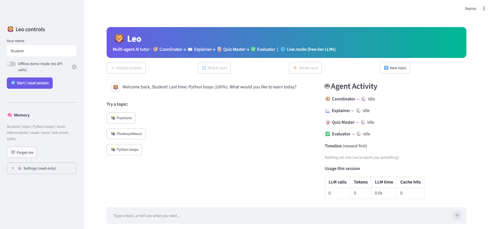 | 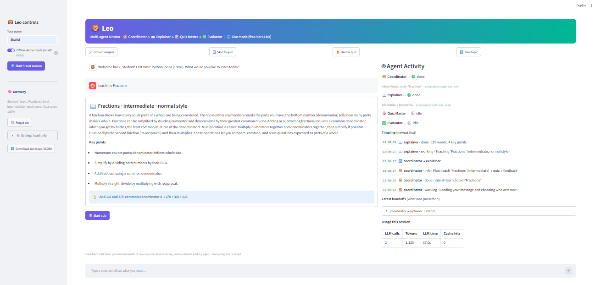 | 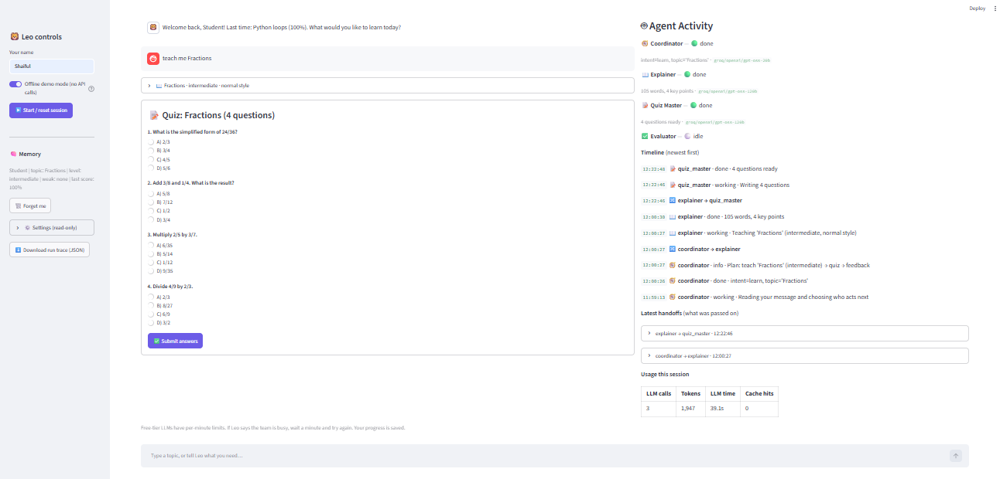 |

| Feedback and re-teach | Hand-off payloads | Run trace |
|---|---|---|
| 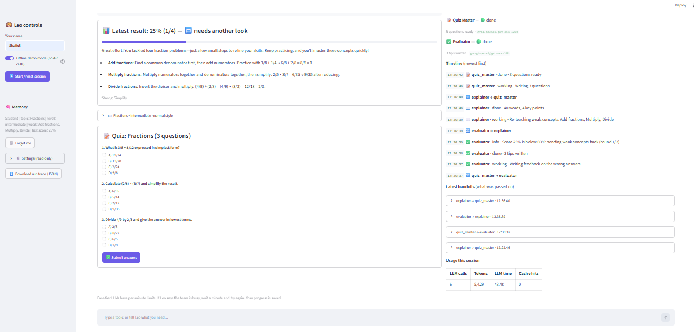 | 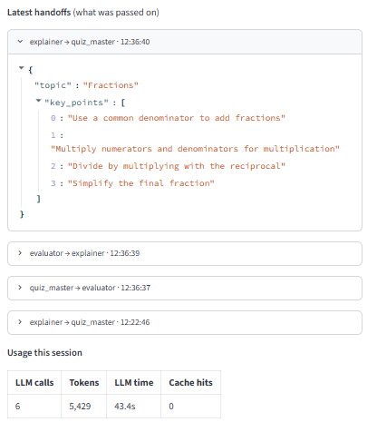 | 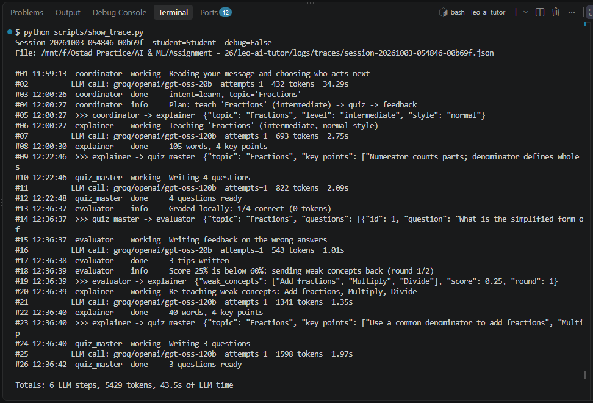 |

| CLI | Tests |
|---|---|
| 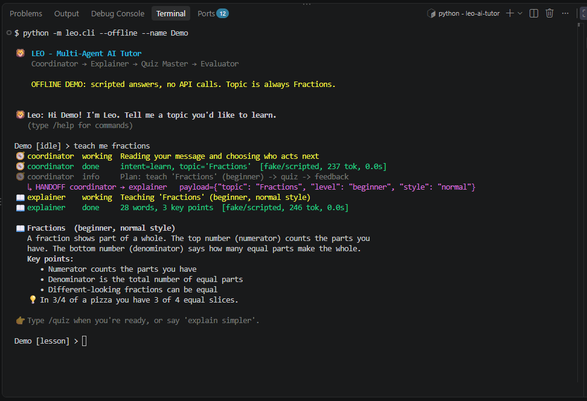 | 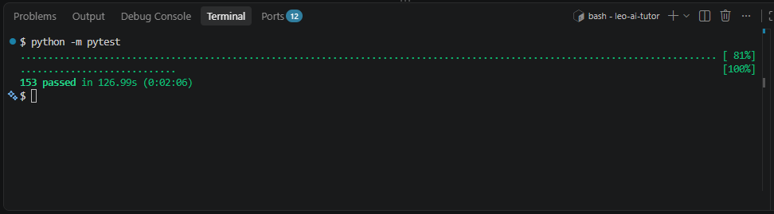 |

### Demo Video
> Demo video (3 to 5 minutes): [Watch the demo video](https://drive.google.com/file/d/18-VSJO2wC6HE59OAKHZIfVM8XL5ZE_hr/view?usp=sharing)

## Logging and debugging

| Where | What it holds | How to read it |
|---|---|---|
| Console | Colored logs: green INFO, yellow WARNING, red ERROR | Visible while running |
| `logs/leo.log` | The same logs, rotating at about 1 MB (5 backups) | `tail -n 40 logs/leo.log` |
| `logs/handoffs.jsonl` | One JSON line per agent hand-off | `tail -n 5 logs/handoffs.jsonl` |
| `logs/traces/session-*.json` | The full story of one session | `python scripts/show_trace.py` (`make trace`) |

Every agent has its own logger (`leo.agent.explainer`, `leo.agent.quiz_master`, ...). A hand-off record looks like this:

```json
{"ts": "2026-10-01T10:11:33+00:00", "from": "explainer", "to": "quiz_master",
 "payload_bytes": 179, "duration_s": 1.57, "tokens": 688, "note": ""}
```

**Secrets never reach the logs.** A logging filter masks anything shaped like a Groq or Gemini key, bearer token or `api_key=` value, and keys are stored as `SecretStr`.

**`DEBUG_MODE=true`:**
- sets the console and file log level to DEBUG,
- shows third-party library logs and CrewAI's own panels,
- adds each prompt and raw model output (redacted) to the trace,
- shows a "last 20 events" panel in Streamlit.

**A good debugging routine:**
1. Reproduce with `python -m leo.cli --offline`. If it works, the problem is in the LLM layer. If it fails, it is in the orchestration.
2. Read the last lines of `logs/leo.log` and look for `WARNING` and `ERROR`.
3. Run `python scripts/show_trace.py` and look for `FALLBACK`, `SAFE-DEFAULT` or many attempts.
4. For bad model output, enable `DEBUG_MODE` and read `raw_output` in the trace.
5. Write a failing test with the scripted runner, then fix it.

**Try the failure path on purpose** (environment variables override `.env`, so no file is edited):

```bash
GROQ_API_KEY=gsk_invalid GEMINI_API_KEY=invalid python -m leo.cli --name Demo --topic fractions
```

## Testing

```bash
python -m pytest                          # everything: 153 tests
python -m pytest -m "not slow and not ui" # skip the tests that import CrewAI (about 133 tests)
python -m pytest --cov=leo --cov-report=term-missing
```

The tests need **no API keys, no network and no tokens**. `tests/conftest.py` sets fake keys and temporary folders before Leo is imported, so tests can never touch real keys, logs or the memory database. The orchestrator is driven by a `ScriptedRunner` (a fake agent runner) and the fallback logic by fake LLM calls that raise chosen errors.

| File | Covers |
|---|---|
| `test_schemas.py` | Cleaning messy LLM JSON, rejecting broken JSON, exact grading, report logic |
| `test_memory.py` | Profiles, merged weak areas, history cap, cache keys and styles, corrupt-database recovery |
| `test_fallback.py` | Error classification, backoff, rate limiter, retries, repair prompts, model switching, safe defaults |
| `test_coordinator.py` | 0-token routing rules, unclear and unsafe input, Coordinator outage |
| `test_flow.py` | Hand-off chain, compact payloads, feedback loop and its cap, caching, memory use, human-in-the-loop, traces |
| `test_helpers.py` | JSON extraction, prompts, injection hygiene, token-budget guard, key redaction, `cache_breakpoint` shim |
| `test_config.py` | Validation, fallback chains, secret safety |
| `test_tools_agents.py` | Calculator safety, tool switches, agents built from their YAML prompts |
| `test_ui_smoke.py` | Headless Streamlit run in offline mode |

Code quality: `make format` runs `ruff --fix` and `black`; `make lint` checks both (line length 100).

## Troubleshooting

| Symptom | Cause | Fix |
|---|---|---|
| `ImportError: Google Gen AI native provider not available` | The optional Gemini extra is not installed | `pip install "crewai[google-genai]"` (already in `requirements.txt`) |
| `404 ... model is no longer available to new users` | Google retired that model name for new accounts | Put a current name in `.env` (the error message usually suggests one). `check_setup.py` only checks the model list, so confirm with a real call |
| `429 RESOURCE_EXHAUSTED` / `quota exceeded` | Free-tier limit reached (we saw a 20-request limit on one Gemini model) | Wait and retry. Leo already switches model on long waits. Rehearse with `--offline` to save quota. Check <https://ai.dev/rate-limit> |
| `GroqException ... property 'cache_breakpoint' is unsupported` | Known CrewAI bug: an Anthropic-only marker reaches Groq (upstream issue [#5886](https://github.com/crewAIInc/crewAI/issues/5886)) | Already handled by `leo/compat.py`. If you removed it, restore it, or upgrade CrewAI to a release that fixes the bug |
| `Invalid API Key` / `401` / `API key not valid` | Typo or revoked key | Re-copy the key into `.env` with no quotes or spaces, then run `python scripts/check_setup.py` |
| "I can't reach my AI models. The API keys or model names look wrong." | Every model was rejected (keys or names) | Run `python scripts/check_setup.py` and fix what it flags |
| "My teaching team is busy right now" | Rate limits or an outage on every model | Wait about a minute and try again. Progress is saved |
| `ValidationError` for `Quiz` or `Explanation` in the logs | The model returned JSON that breaks the schema | Leo retries once with a repair prompt, then switches model. To inspect: `DEBUG_MODE=true`, then read `raw_output` in the trace |
| Empty model output | `gpt-oss` models spend the token limit on hidden reasoning | Raise the `MAX_TOKENS_*` values in `.env` |
| `requires a different Python` / install fails on Python 3.14 or 3.9 | CrewAI supports Python 3.10 to 3.13 | Recreate the venv with a supported Python |
| `cannot import name 'BaseTool' from 'crewai.tools'` or other CrewAI errors | CrewAI version mismatch | `pip install -r requirements.txt` to get the tested versions (crewai 1.15.23) |
| Install fails with a `lancedb` error | Intel Mac (no wheel for a dependency) | Use Linux, WSL, Codespaces or Colab |
| First request takes about 40 seconds | CrewAI import on a slow (Windows-mounted) drive | Keep the project in the Linux filesystem, for example `~/leo-ai-tutor` |
| Streamlit reloads constantly or feels slow | File watcher on a slow drive | `streamlit run app.py --server.fileWatcherType none` |
| `make: command not found` | `make` is not installed | `sudo apt install make`, or run the underlying commands (see [How to run](#how-to-run)) |
| `Text file busy` when typing `logs/leo.log` | You tried to run the log file | Use `tail -n 40 logs/leo.log` |

## Security

- **No secrets in the repo.** `.env` is git-ignored and only the placeholder-only `.env.example` is committed. Check before pushing: `git ls-files | grep -E "^\.env$"` must print nothing, and `git grep -nE "gsk_[A-Za-z0-9]{20,}|AIza[0-9A-Za-z_-]{30,}"` must find no real keys.
- **Keys are never logged.** Keys are `SecretStr` values in config, a logging filter redacts key-shaped strings in the console, files and traces, and the settings summary shown in the UI excludes them.
- **If a key leaks**, delete it in the provider console and create a new one.
- **Safe calculator.** No `eval`. Expressions are parsed with `ast` and only a whitelist is evaluated.
- **Prompt-injection hygiene.** Student text is length-limited, fenced as data and never substituted twice. The Coordinator is told to treat it as data. This reduces the risk but is not a guarantee.
- **Privacy.** Only compact facts are stored (no transcripts). `/forget` or **Forget me** deletes a student. CrewAI telemetry is disabled by default.

## Limitations

- **Free-tier limits.** Quotas change, and a long session can hit per-minute limits. Leo backs off and falls back, but cannot create quota.
- **Token use varies** from run to run because reasoning-style models use a variable number of hidden tokens.
- **Quiz quality depends on the model.** Questions are validated structurally, not for factual accuracy or ideal difficulty.
- **Multiple-choice only.** This keeps grading exact and free of tokens. Free-text answers are on the roadmap.
- **One student per session**, with no login. Memory is a local SQLite file keyed by name.
- **Each step is its own one-task Crew** rather than one long-running Crew. This was chosen for per-step fallback and testability.
- **Slow first request** on slow disks, because CrewAI is a large import.
- Developed and tested on Python 3.12 / Ubuntu (WSL). Other platforms should work but are untested.
- English prompts only.

## Roadmap

- [ ] Short-answer questions graded by the Evaluator with a rubric
- [ ] Spaced-repetition scheduling from the stored history
- [ ] Optional embeddings-based memory and topic recommendations
- [ ] Login and a server database (PostgreSQL) for many students
- [ ] Docker image and a GitHub Actions workflow (lint and tests)
- [ ] Streaming responses in the UI
- [ ] Multi-language lessons and prompts
- [ ] An evaluation harness that scores quiz quality automatically
- [ ] Remove `leo/compat.py` once the upstream CrewAI fix ships

## Requirements coverage

| Requirement | Where it is satisfied |
|---|---|
| At least 4 distinct agents, each with its own role, prompt and behaviour | `leo/agents.py` plus `leo/prompts/*.yaml` (Coordinator, Explainer, Quiz Master, Evaluator) |
| CrewAI used to build and coordinate the agents | `leo/agents.py`, `leo/tasks.py` (`Agent`, `Task`, sequential `Crew`) |
| Real hand-offs between agents | `leo/crew.py` (`_handoff`), `logs/handoffs.jsonl`, the Agent Activity panel |
| Clear orchestration pattern | Sequential pipeline with Coordinator routing ([Orchestration pattern](#orchestration-pattern)) |
| Memory and a prompt template per role | `leo/memory.py`, `leo/prompts/*.yaml` |
| Optional tools | `leo/tools.py` (calculator, web search) |
| Problems handled gracefully by the Coordinator | `leo/crew.py` (`graceful`, `quick_route`), `leo/llm_factory.py` |
| Interface showing which agent is doing what | `app.py` (Agent Activity panel) and `leo/cli.py` |
| Bonus: feedback loop | `LeoSession._reteach` in `leo/crew.py` |
| Bonus: human-in-the-loop | `LeoSession.handle_message`, toolbar buttons, CLI interruptions |
| Code, `requirements.txt`, no keys committed | This repo, `.gitignore`, [Security](#security) |
| README with agents, diagram, how to run, orchestration | This document |

## Contributing

Contributions are welcome.

1. Fork the repository and create a branch: `git checkout -b feature/my-change`.
2. Install dev dependencies: `pip install -r requirements-dev.txt`.
3. Make your change and add or update tests. Tests must not need API keys.
4. Run `make format` and `make check` (or the equivalent commands).
5. Open a pull request describing what changed and why.

Please never include API keys, logs or database files in a commit.

## License

Released under the [MIT License](LICENSE). Copyright (c) 2026 SHAIFUL ISLAM.

## Acknowledgements

- [CrewAI](https://www.crewai.com/) for the multi-agent framework
- [Groq](https://groq.com/) and [Google AI Studio (Gemini)](https://aistudio.google.com/) for generous free tiers
- [LiteLLM](https://github.com/BerriAI/litellm) for the model gateway
- [Pydantic](https://docs.pydantic.dev/) and [pydantic-settings](https://docs.pydantic.dev/latest/concepts/pydantic_settings/) for validation and configuration
- [Streamlit](https://streamlit.io/) for the web UI, and [Mermaid](https://mermaid.js.org/) and [Shields.io](https://shields.io/) for diagrams and badges
